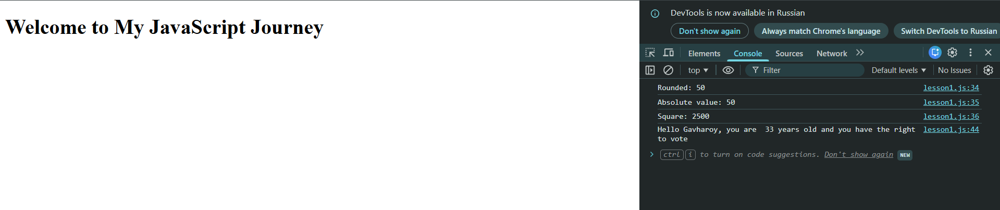

# 🧠 JavaScript Basics Practice

This project contains simple JavaScript exercises to practice fundamental concepts such as variables, conditionals, user input, and math functions.

---

## 📌 Features

* 📝 User input using `prompt()`
* 🔢 Number conversion and validation
* ➗ Math operations:

  * Rounding numbers
  * Absolute value
  * Square calculation
* 🔀 Conditional logic (`if / else`)
* 💬 Dynamic messages using template literals

---

## 🚀 How It Works

1. User enters a number:

   * The program displays:

     * Rounded value
     * Absolute value
     * Square of the number

2. User enters name and age:

   * The program checks:

     * If age > 18 → allowed to vote
     * If age = 18 → can vote this year
     * If age < 18 → too young

---

## 🖼️ Screenshot

---

## 💻 Technologies Used

* HTML
* JavaScript (Vanilla JS)

---

## 📚 What I Learned

* How to use `prompt()` and `alert()`
* Converting string to number using `Number()`
* Using `Math` functions in JavaScript
* Writing conditional statements
* Using template literals for dynamic text

---

## 🔗 Future Improvements

* Add a graphical UI (HTML + CSS)
* Replace `prompt()` with input fields
* Add error messages in the UI instead of console
* Improve design and user experience

---

## 👩‍💻 Author

**Gavharoy**

---

⭐ If you like this project, feel free to give it a star!
