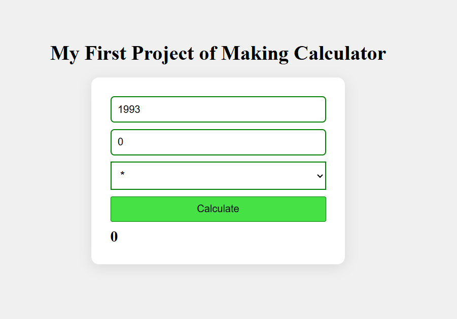

# JavaScript Basics — My Learning Journey

A structured collection of lessons and practice projects built while learning core JavaScript concepts: variables, functions, loops, DOM manipulation, and events.

## Live Demo

🔗 https://gavharoy02209-dev.github.io/Javascript-basics/

## Featured Project: Calculator 🧮

A calculator built with vanilla JavaScript and DOM manipulation.

**Features:** Addition, Subtraction, Multiplication, Division, Modulus, Power — result displayed live on the page.

## What I Learned

| Topic | Description |
|---|---|
| Variables & data types | let, const, string/number/boolean |
| Loops | for, while, continue |
| Functions | Declarations, parameters, return values |
| DOM manipulation | getElementById, innerHTML |
| Events | onclick, onload |
| Conditionals | if/else, switch/case |

## Structure

- Lesson1–4/ — individual lessons with practice files
- amaliyot/ — additional practice exercises
- practice/ — calculator project (main demo)

## Author

**Gavharoy Boltaboyeva**
JavaScript learning journey 🇺🇿

## Notes

- **Lesson 1** demonstrates document.write() and lert(). Note: document.write() clears the entire page after it has already loaded (e.g. after responding to a prompt) — this is expected browser behavior and is part of what the lesson teaches, not a bug.
